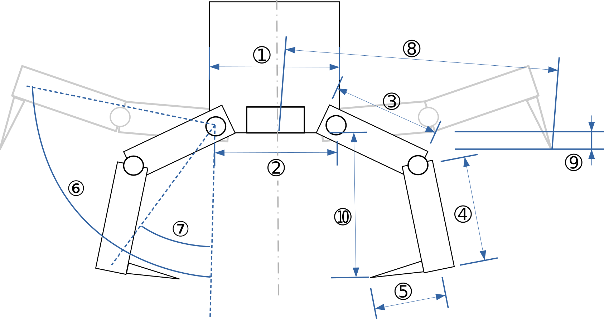

# SRL_GraspableTargetDetection
Geometry based graspable target detection for legged robots.

Originated in the Space Robotics Lab (SRL) of the Tohoku University. Based on ClimbLab (Uno et al. 2022).

## Authors and Maintainers

*   Jitao Zheng (jitao.zheng@tum.de)

*   Taku Okawara (taku.okawara.t3@dc.tohoku.ac.jp)

*   Kentaro Uno (unoken@astro.mech.tohoku.ac.jp)

*   Antonin Ringeval-Meusnier (r.antonin@orange.fr)

## System Requirements

The code was tested on: 
*   ROS Humble
*   Ubuntu 22.04
*   gcc version 11.4.0

You will require the following packages and libraries:
*   Point Cloud Library (PCL)
*   LibInterpolate
*   Eigen3


## Installation of LibInterpolate

```
git clone https://github.com/CD3/libInterpolate
cd libInterpolate
mkdir build
cd build
cmake ..
make
sudo make install
```

## Make Sure that you have ALL the pcl libraries installed

If you don't have yet installed Point Cloud Library (PCL), you can install it by typing:

```
sudo apt install libpcl-dev
```

This one was missing so be sure to install it

```
sudo apt install ros-humble-ros-pcl 
```


## Quick Start


Open a new terminal window.

Type:

```
cd ~/ros2_ws/src
```
Clone the repository:
```
git clone <address>
```

Then we can build it:

```
cd ..
colcon_build
```

IMPORTANT, don't forget to sourcing the packages you just build in order for them to show when you want to run them:
```
source install/setup.bash
```

We will first test the algorithm on some examples. You will need at least three terminals.

*Terminal 1*

Launch the graspable target detection.
```
cd ~/ros2_ws
source install/setup.bash
ros2 run detect_graspable_points detect_graspable_points_main 
```
The algorithm subscribes to a point cloud message `merged_pcd` in `sensor_msgs/PointCloud2` format. So in principle, you can subscribe to any tope

*Terminal 2*

Publish stored example point cloud.
```
cd ~/ros2_ws
source install/setup.bash
ros2 run detect_graspable_points publish_pointcloud2
```
Now, a point cloud in *.pcd* format will be published once per second as `sensor_msgs/PointCloud2` message under the topic `/merged_pcd` in the `regression_plane_frame` coordinate frame.

*Terminal 3*

Open RVIZ.
```
cd
ros2 run rviz2 rviz2
```
You can freely choose which topic you want to visualize, whether that is the raw point cloud with the graspable points (light green spheres) or the color gradient of Graspability Score.

### Input Point Cloud

Copy the point cloud you want to examine into the folder `detect_graspable_points/src/pcd_data/` and change the path in the program `publish_pointcloud2.cpp`. Make sure that it is in .pcd format. Of course the algorithm can also subscribe to any PointCloud2 message with the name `/merged_pcd` coming from other nodes.

## Output

This package output several data for visualization. If you are only interested in the graspable point it is pulished as `/detect_graspable_point/graspable_points`. To choose the different gripper in this file just turn to true the gripper you want to use and flase the others.

### Gripper Parameters

The edition of parameters now takes place in `settings.hpp` in `include/detect_graspbable_points` folder.

Orientate yourself to the simplified dimensions of this gripper:



| No. | Variable                       | Explanation                                                                           |
|-----|--------------------------------|---------------------------------------------------------------------------------------|
| 1   | Palm diameter                  | Diameter of gripper's palm                                                            |
| 2   | Palm diameter of finger joints | Distance between two opposite first finger joints                                     |
| 3   | Finger length                  | Length of the first finger segment                                                    |
| 4   | Spine length                   | Length of the last finger segment                                                     |
| 5   | Spine depth                    | Length of the spine itself                                                            |
| 6   | Opening angle                  | Maximum opening angle                                                                 |
| 7   | Closing angle                  | Maximum closing angle                                                                 |
| 8   | Opening spine radius           | Distance from the center of the palm to the tip of the furthest spine                 |
| 9   | Opening spine depth            | Distance from the horizontal plane to the tip of the spine when opened                |
| 10  | Closing height                 | Vertical distance between the tip of the spine and the bottom of the palm when closed |

*TODO:* I don't know what exactly *"margin_of_top_solid_diameter"* and *"inside_margin_of_bottom_void_diameter"* are. Please complement this Readme if anyome knows more.

### Matching Parameters

The matching parameters are the most essential parameters for the graspability and curvature analysis. 

| No. | Variable                                       | Data type       |
|-----|------------------------------------------------|-----------------|
| 1   | Voxel size                                     | float [m]       |
| 2   | Threshold of Solid Voxels                      | int             |
| 3   | Graspability threshold                         | int             |
| 4   | FINNER_INTERPOLATION                           | float           |


## Troubleshooting

If libinterpolated dosn't get build even after installing catch2, make sure to have GSL installed and restarting your computer might help.