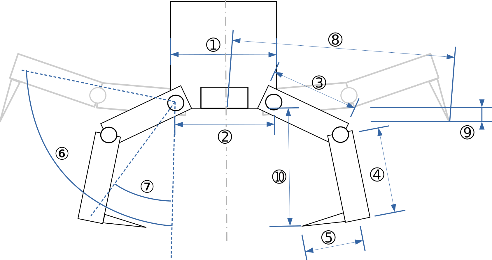

# graspable_points_detection_ros2

Geometry based graspable target detection for legged climbing robots.

Originated in the Space Robotics Lab (SRL) of the Tohoku University. Based on ClimbLab (Uno et al. 2022).

## Requirements

The code was tested on:

- ROS 2 Humble
- Ubuntu 22.04
- gcc version 11.4.0

You will require the following packages and libraries:

- Eigen3
- Catch2
- LibInterpolate
- Point Cloud Library (PCL)

## Installation & Environment Setup

1. Clone the repository

    ```bash
    # Make a workspace
    mkdir -p cd ~/ros2_ws/src && cd cd ~/ros2_ws/src

    # Clone the packages to your workspace
    git clone https://github.com/Space-Robotics-Laboratory/graspable_points_detection_ros2.git
    ```

1. Installation of Catch2

    ```bash
    git clone https://github.com/catchorg/Catch2.git
    cd Catch2
    cmake -B build -S . -DBUILD_TESTING=OFF
    sudo cmake --build build/ --target install
    ```

1. Installation of LibInterpolate

    ```bash
    git clone https://github.com/CD3/libInterpolate
    cd libInterpolate
    mkdir build && cd build
    cmake ..
    make
    sudo make install
    ```

1. Make Sure that you have ALL the pcl libraries installed

    If you don't have yet installed Point Cloud Library (PCL), you can install it by typing:

    ```bash
    sudo apt install libpcl-dev
    sudo apt install ros-humble-pcl-ros
    ```

## Testing Algorithm with Example Point Cloud

1. Build

    ```bash
    cd ~/ros2_ws
    colcon build --symlink-install
    ```

2. Launch nodes (`graspable_target_detection` and `point_cloud_publisher`).

    ```bash
    . install/setup.bash
    ros2 launch graspable_points_detection test.launch.py
    ```

> [!NOTE]
> If you want to change example point cloud, edit `pcd_file_name` in `config/test.yaml`.

## Interfaces

### Input Point Cloud

Copy the point cloud you want to examine into the folder `data/` and change the path in the program `point_cloud_publisher.cpp`.
Make sure that it is in `.pcd` format. Of course the algorithm can also subscribe to any PointCloud2 message coming from other nodes.

### Output

- For visualization
  - `/graspable_target_detection/downsampled_points` (sensor_msgs::msg::PointCloud2)
  - `/graspable_target_detection/interpolated_points` (sensor_msgs::msg::PointCloud2)
  - `/graspable_target_detection/graspability_score_map` (sensor_msgs::msg::PointCloud2)
  - `/graspable_target_detection/high_graspability_score_map` (sensor_msgs::msg::PointCloud2)
  - `/graspable_target_detection/graspable_points_marker` (visualization_msgs::msg::Marker)
  - `/graspable_target_detection/normal_vector` (visualization_msgs::msg::Marker)

- For planner
  - `/graspable_target_detection/graspable_points` (geometry_msgs::msg::PoseArray)

## Parameter Description

### Gripper Parameters

Gripper parameters are defined in `include/graspable_target_detection/gripper_params.hpp`.

Orientate yourself to the simplified dimensions of this gripper:



| No. | Variable                       | Unit  | Explanation                                                                           |
|-----|--------------------------------|-------|---------------------------------------------------------------------------------------|
| 1   | Palm diameter                  | [mm]  | Diameter of gripper's palm                                                            |
| 2   | Palm diameter of finger joints | [mm]  | Distance between two opposite first finger joints                                     |
| 3   | Finger length                  | [mm]  | Length of the first finger segment                                                    |
| 4   | Spine length                   | [mm]  | Length of the last finger segment                                                     |
| 5   | Spine depth                    | [mm]  | Length of the spine itself                                                            |
| 6   | Opening angle                  | [deg] | Maximum opening angle                                                                 |
| 7   | Closing angle                  | [deg] | Maximum closing angle                                                                 |
| 8   | Opening spine radius           | [mm]  | Distance from the center of the palm to the tip of the furthest spine                 |
| 9   | Opening spine depth            | [mm]  | Distance from the horizontal plane to the tip of the spine when opened                |
| 10  | Closing height                 | [mm]  | Vertical distance between the tip of the spine and the bottom of the palm when closed |

> [!CAUTION]
> *TODO:* Current maintainers don't know what exactly `margin_of_top_solid_diameter` and `inside_margin_of_bottom_void_diameter` are. Please complement this README if anyone knows more.

> [!NOTE]
> If you want to use the different gripper model, edit `GripperModel` in `include/graspable_target_detection/gripper_params.hpp`.

### Matching Parameters

Matching parameters are defined in `include/graspable_target_detection/matching_params.hpp`.

The matching parameters are the most essential parameters for the graspability and curvature analysis.

| No. | Variable                                       | Data type       | Explanation                                                    |
|-----|------------------------------------------------|-----------------|----------------------------------------------------------------|
| 1   | Voxel size                                     | float [m]       | Size of voxels you want to use                                 |
| 2   | Threshold of Solid Voxels                      | int             | Number of solid voxels needed to not apply penalty coefficient |
| 3   | Artificial_add_point                           | String (on/off) | True if you think your map is too sparse for running properly  |
| 4   | Delete lower targets z-threshold               | float [m]       | Threshold below which point are not checked for graspability   |
| 5   | Auxiliary void voxel layers above gripper mask | int             | Empty layers to avoid false matching on too convex shape       |
| 6   | Graspability threshold                         | int             | Graspability above which we consider graspable with certainty  |

## Troubleshooting

- If `libinterpolated` doesn't get build even after installing catch2, make sure to have GSL installed and restarting your computer might help.

## Authors and Maintainers

- Jitao Zheng (jitao.zheng at tum.de)
- Antonin Ringeval-Meusnier (r.antonin at orange.fr)
- Taku Okawara (taku.okawara.t3 at dc.tohoku.ac.jp)
- Kentaro Uno (unoken at tohoku.ac.jp)
- Masazumi Imai (imai.masazumi.p2 at dc.tohoku.ac.jp)
